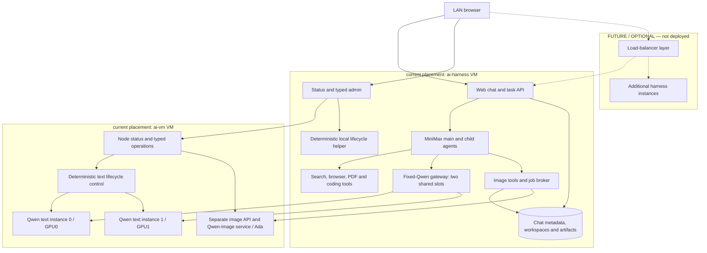

# Sova

The deployed harness, image and status features described here are documented
from `feature/system-topology` (PRs 5–8) and are **not yet merged into main**.
Their current source/configuration/evidence links explicitly target that
feature branch; this main-based change adds documentation only.

Sova is the whole-system name for this open-source AI workspace project: a
chat/task harness, MiniMax agent runtime, two Qwen text instances, dedicated
image generation and guarded editing, search/browser/PDF/coding tools, and
deterministic lifecycle, status and administration software. Source paths, VM
names and runtime identifiers retain their existing names. The intended
top-level Apache-2.0 license text remains outstanding; see [License](#license)
and the [harness component licenses](https://github.com/djeZo888/mixed-memory-llm-api-server/blob/feature/system-topology/ai-harness/README.md#licenses).

Start with the [harness user guide](https://github.com/djeZo888/mixed-memory-llm-api-server/blob/feature/system-topology/ai-harness/README.md),
[architecture and future routing design](docs/sova-architecture.md), and
**[TODO and current H007 update policy](TODO.md)**. The
[H006 registry/configuration extension guide](https://github.com/djeZo888/mixed-memory-llm-api-server/blob/feature/system-topology/ai-harness/docs/status-registry.md)
and [H006 closeout](https://github.com/djeZo888/mixed-memory-llm-api-server/blob/feature/system-topology/docs/h006-closeout-20260926.md) describe the reviewed
observation and placement foundation. H006's naming and update-policy statements
remain evidence of that dated checkpoint; Sova is now the selected system name.
Going forward, the new manual-update policy supersedes H006's
package-installation-enabled policy: disable all automatic OS/package/Sova
updates while preserving manual action. Worker1's H007 change is **IN PROGRESS,
not yet accepted**; the [root-owned policy report](https://github.com/djeZo888/mixed-memory-llm-api-server/blob/feature/system-topology/docs/h007-update-policy-20260926.md)
is **pending publication**. The historical H006 report stays unchanged.

Boxes describe logical roles; some share a process. Cross-VM calls use the
reviewed private transports. The optional future load balancer and its dashed
links are **not deployed** and are not required for every topology. Harness
replication requires the ownership, shared data and admission work described in
the [architecture](docs/sova-architecture.md#placement-and-horizontal-scaling).

Two VMs are the current placement, not a mandatory architecture. One host/VM can
colocate compatible services; future deployments may span many VMs with multiple
instances per model. Every placement still needs compatible hardware and runtime,
adequate resources, registered storage, network/security policy and explicit
deployment work. Registry edits alone do not relocate workloads or select models.

The ai-vm role remains API-only, with separate direct inference endpoints and
**no common ai-vm inference router**. The harness already has its own fixed-Qwen
gateway: main agents, child agents and auxiliary calls share exactly two global
inference slots. Image tools use a separate service; GLM is not integrated into
the harness. Flexible routing is an accepted future design, not implemented
arbitrary-model selection.

## Historical September 21 runtime and API acceptance

The following preserves the September 21 checkpoint and its acceptance
limits, not current whole-system readiness. Later harness/image/status
deployment evidence is on `feature/system-topology`; see the
[H005 resilience closeout](https://github.com/djeZo888/mixed-memory-llm-api-server/blob/feature/system-topology/docs/h005-closeout-20260926.md)
and the H006 links in the current overview above.

At this checkpoint the project covered the API-only local AI server for
**Qwen3.8-27B FP8** and **GLM5.3 UD-Q4_K_XL**.
Reviewed source `04143b18cca7aca724d9a4a4bcf943fe86c040db` defines **dual-qwen**
as the default: one Qwen instance per GPU. Optional **glm-qwen** replaces only
GPU0 with GLM; returning to dual-qwen replaces GPU0 with Qwen again.

**Live production acceptance PASS — 2026-09-21, 03:21 UTC.** The saved
[activation proof](reports/dualq-480k-20260921.md#dated-production-acceptance--2026-09-21)
records both Qwen instances warm/ready with persisted running/resume intent.
GPU0 Qwen → GLM → Qwen took 255.585590 / 120.568066 s per operation, excluding
pre-admission/status overhead; GPU1 retained its identity through both switches.
Qwen schema/tool continuation and GLM native 480K plus a correct smoke passed.
Refresh status before use; this is a dated snapshot.

| Placement / control target | Deployment ID and public instance ID | Inference alias / port |
| --- | --- | --- |
| GPU0 / `glm`, default | `qwen38-27b-q0-480000-yarn4-bf16kv` | `qwen3.8-27b-gpu0` / 30002 |
| GPU1 / `qwen`, both modes | `qwen38-27b-q1-480000-yarn4-bf16kv` | `qwen3.8-27b` / 30004 |
| GPU0 / `glm`, optional | `glm-5.3-ud-q4-k-xl-g1-480000` | `glm-5.3` / 30002 |

All three configure **480,000 tokens** on the existing **72-vCPU guest**.
Both Qwen instances share guest CPUs 0–7 (union 8); optional GLM uses 0–71,
sharing 0–7 with GPU1 Qwen. These are guest affinity masks, not exclusive cores
or physical host pinning. [Model matrix](docs/model-matrix.md) records resources
and the distinction between configured, accepted and measured occupied context.

The [one-pair dual-Q benchmark](reports/dualq-480k-20260921.md) completed in
258.9091 s: occupied context 479,490 / 479,495. Both semantic checks passed;
Q1's outer JSON fence failed strict formatting. Output windows did not overlap.
Its STOPPED/manual restoration is historical benchmark state, not production
state or activation acceptance.

### API contract at the September 21 checkpoint

Control uses `http://10.156.100.60:30000/control/v1/...`. Clients discover and
explicitly address separate inference bases on ports 30002 and 30004, each
with `/v1`; the aliases above identify the loaded instance. There is no common
inference router or automatic fallback. Native listeners stay authenticated
IPv4 loopback behind the reviewed private transport.

- [API operations and examples](docs/ai-vm-api-operations.md): discovery,
  separate credentials, targeted switch/poll and inference.
- [Control contract](docs/control-api.md) and [inference contract](docs/api-contract.md).
- [Operations](docs/operations.md): durable VM ownership, guards and recovery.
- [Mode, migration and rollback contract](docs/concurrent-api.md).
- [Private client transport](docs/direct-client-network.md) and
  [protected credentials](docs/agent-client.md#protected-key-file).

`mutation_busy` describes lifecycle work. Inference running/queued counts and
external backlog remained unknown; Ready does not mean idle. At this checkpoint
the harness was future work, expected to own dispatch, backlog and drain before
a targeted switch. Switching a
running target requires `allow_interrupt:true`, fresh identity/generation and
operation polling; the server provides no atomic drain guarantee.

Enabled VM services own control, private transport and lifecycle, with no
Worker1, SSH or benchmark-keeper lifetime dependency. Control restart and warm
idempotent boot-intent replay passed; fresh clients still received correct
answers after activation SSH exited. **Hardware boot, cold-boot replay and
live full rollback remain NOT_TESTED.**

At this checkpoint tools, browsing and file work ran on ordinary external
clients in trusted workspaces, and a separate frontend VM was planned. The
[current overview](#sova) describes the deployed harness and flexible placement;
two VMs are not required for every deployment. **Installer implementation and
tests remain paused.**

### Earlier historical evidence

The prior [singleton acceptance](reports/apiaccept-lan-acceptance.md),
[stage-one qualifications](reports/stage1-ai-vm-status.md),
[cleanup report](reports/finalops-reboot-cleanup.md) and
[installer record](docs/installation.md) retain their original scope. Earlier
TP2/1M configurations and success statements do not establish current dual-Q
acceptance. Historical reports are unchanged.

## License

Apache-2.0 is intended; the full license text remains outstanding.
See [LICENSE.todo.md](LICENSE.todo.md).
