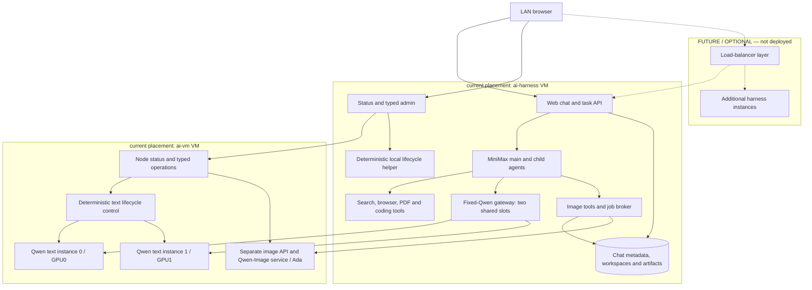

# Sova

Sova is the whole-system name for this open-source AI workspace project: a
chat/task harness, MiniMax agent runtime, two Qwen text instances, dedicated
image generation and guarded editing, search/browser/PDF/coding tools, and
deterministic lifecycle, status and administration software. Source paths, VM
names and runtime identifiers retain their existing names. The intended
top-level Apache-2.0 license text remains outstanding; see [License](#license)
and the [harness component licenses](ai-harness/README.md#licenses).

Start with the [harness user guide](ai-harness/README.md),
[architecture and future routing design](docs/sova-architecture.md), and
**[TODO and current H007 update policy](TODO.md)**. The
[H006 registry/configuration extension guide](ai-harness/docs/status-registry.md)
and [H006 closeout](docs/h006-closeout-20260926.md) describe the reviewed
observation and placement foundation. H006's naming and update-policy statements
remain evidence of that dated checkpoint; Sova is now the selected system name.
Going forward, the new manual-update policy supersedes H006's
package-installation-enabled policy: disable all automatic OS/package/Sova
updates while preserving manual action. Worker1's H007 change is **IN PROGRESS,
not yet accepted**; the [root-owned policy report](docs/h007-update-policy-20260926.md)
is **pending publication**. The historical H006 report stays unchanged.

Boxes describe logical roles; some share a process. Cross-VM calls use the
reviewed private transports. The optional future load balancer and its dashed
links are **not deployed** and are not required for every topology. Harness
replication requires the ownership, shared data and admission work described in
the [architecture](docs/sova-architecture.md#placement-and-horizontal-scaling).

Two VMs are the current placement, not a mandatory architecture. One host/VM can
colocate compatible services; future deployments may span many VMs with multiple
instances per model. Every placement still needs compatible hardware and runtime,
adequate resources, registered storage, network/security policy and explicit
deployment work. Registry edits alone do not relocate workloads or select models.

The ai-vm role remains API-only, with separate direct inference endpoints and
**no common ai-vm inference router**. The harness already has its own fixed-Qwen
gateway: main agents, child agents and auxiliary calls share exactly two global
inference slots. Image tools use a separate service; GLM is not integrated into
the harness. Flexible routing is an accepted future design, not implemented
arbitrary-model selection.

## Current models and dated acceptance

Text profiles cover **Qwen3.8-27B FP8** and optional **GLM5.3 UD-Q4_K_XL**;
the dedicated image model is **Qwen-Image-2.1**.
Reviewed source `04143b18cca7aca724d9a4a4bcf943fe86c040db` defines **dual-qwen**
as the default: one Qwen instance per GPU. Optional **glm-qwen** replaces only
GPU0 with GLM; returning to dual-qwen replaces GPU0 with Qwen again.

**Live production acceptance PASS — 2026-09-21, 03:21 UTC.** The saved
[activation proof](reports/dualq-480k-20260921.md#dated-production-acceptance--2026-09-21)
records both Qwen instances warm/ready with persisted running/resume intent.
GPU0 Qwen → GLM → Qwen took 255.585590 / 120.568066 s per operation, excluding
pre-admission/status overhead; GPU1 retained its identity through both switches.
Qwen schema/tool continuation and GLM native 480K plus a correct smoke passed.
Refresh status before use; this is a dated snapshot.

| Placement / control target | Deployment ID and public instance ID | Inference alias / port |
| --- | --- | --- |
| GPU0 / `glm`, default | `qwen38-27b-q0-480000-yarn4-bf16kv` | `qwen3.8-27b-gpu0` / 30002 |
| GPU1 / `qwen`, both modes | `qwen38-27b-q1-480000-yarn4-bf16kv` | `qwen3.8-27b` / 30004 |
| GPU0 / `glm`, optional | `glm-5.3-ud-q4-k-xl-g1-480000` | `glm-5.3` / 30002 |

All three text deployment profiles configure **480,000 tokens** on the existing **72-vCPU guest**.
Both Qwen instances share guest CPUs 0–7 (union 8); optional GLM uses 0–71,
sharing 0–7 with GPU1 Qwen. These are guest affinity masks, not exclusive cores
or physical host pinning. [Model matrix](docs/model-matrix.md) records resources
and the distinction between configured, accepted and measured occupied context.

The [one-pair dual-Q benchmark](reports/dualq-480k-20260921.md) completed in
258.9091 s: occupied context 479,490 / 479,495. Both semantic checks passed;
Q1's outer JSON fence failed strict formatting. Output windows did not overlap.
Its STOPPED/manual restoration is historical benchmark state, not production
state or activation acceptance.

The dedicated Ada image service preserves both warm text Qwens and their 480,000-token
profiles. Its six accepted opaque generation sizes are **1024x1024, 1024x576,
1216x704, 1472x832, 1760x992 and 1920x1080**. The public hard ceiling is
1920x1080 / 2073600 pixels. Full HD uses native 1920x1088 and removes exactly eight
bottom rows; smaller profiles keep native=public. No resize. Qualified guarded
editing is recorded in the [current acceptance report](docs/service-resilience-acceptance.md)
and [harness guide](ai-harness/README.md#image-generation-and-editing). Transparency,
public 1920x1088 and UHD remain outside the accepted scope.

**Historical Full HD checkpoint — 2026-09-23:** image API/helper source was
`36c7c2d2ee8d9ed59e9310e708eb640c5aecad5e`.
One Full HD Lake Bled acceptance returned a fully decoded RGB PNG in 54.8s helper
time, with the API ready/idle afterward and both original text containers unchanged.
See [Full HD deployment and acceptance](reports/image21-fhd-20260923/RESULT.md)
and [ready-to-run examples with full prompts](examples/image-api/README.md).
The [historical qualification](reports/image21-qualify-20260923/RESULT.md) retains
native 1920x1088 timing/memory evidence (8.88% sampled device-free margin); no new
memory benchmark was run for the identical native workload.

## Use the APIs

Control uses `http://10.156.100.60:30000/control/v1/...`. Clients discover and
explicitly address separate inference bases on ports 30002 and 30004, each
with `/v1`; the aliases above identify the loaded instance. These direct ai-vm
APIs have no common inference router or automatic fallback; the harness's
fixed-Qwen gateway is a separate client-side component. Native listeners stay
authenticated IPv4 loopback behind the reviewed private transport.

- [Image API source and integration](docs/image-api.md): private image API interface.
  The [current acceptance report](docs/service-resilience-acceptance.md) records
  qualified generation/editing, retained limitations and exact runtime identities.
- [API operations and examples](docs/ai-vm-api-operations.md): discovery,
  separate credentials, targeted switch/poll and inference.
- [Control contract](docs/control-api.md) and [inference contract](docs/api-contract.md).
- [Operations](docs/operations.md): durable VM ownership, guards and recovery.
- [Mode, migration and rollback contract](docs/concurrent-api.md).
- [Private client transport](docs/direct-client-network.md) and
  [protected credentials](docs/agent-client.md#protected-key-file).

`mutation_busy` describes lifecycle work; readiness does not mean idle. The
harness owns its dispatch, backlog and drain before a targeted switch. Switching a
running target requires `allow_interrupt:true`, fresh identity/generation and
operation polling; the server provides no atomic drain guarantee.

The [September 26 resilience closeout](docs/h005-closeout-20260926.md) records
successful idle/wake and sequential VM reboot recovery. Both Qwens and the Ada
image service restored automatically. Status/admin services, history metadata
and current-boot task containment were verified. Earlier failed attempts remain
in the linked historical record.

Tools, browsing and file work run as an ordinary user in trusted client
workspaces, currently through [ai-harness](ai-harness/README.md) on its own VM.
It provides the deployed shared-LAN chat and task interface; that placement is
not a requirement for all Sova deployments. **Installer implementation and tests
remain paused.**

## Status and administration

Open [status](http://10.156.100.61/status) for read-only service observations and
[admin](http://10.156.100.61/admin) for canonical typed operations. Admin uses the
deployed anonymous trusted/shared-LAN access scope: it has no per-user login or
authentication. Normal operations use admin so ownership, holds and receipts are
maintained; follow the [operator guidance](ai-harness/README.md#operator-use) for
status meanings, idle/wake behavior and uncertain results.

The optional `status.ai-harness` DNS alias is user-managed and status-only. A local
DNS entry may point it at `10.156.100.61`; this guide does not claim DNS is configured.
Use the recorded IP-based admin address above for operations.

## Historical evidence

The prior [singleton acceptance](reports/apiaccept-lan-acceptance.md),
[stage-one qualifications](reports/stage1-ai-vm-status.md),
[cleanup report](reports/finalops-reboot-cleanup.md) and
[installer record](docs/installation.md) retain their original scope. Earlier
TP2/1M configurations and success statements do not establish current dual-Q
acceptance. Historical reports are unchanged.

## License

Apache-2.0 is intended; the full license text remains outstanding.
See [LICENSE.todo.md](LICENSE.todo.md).
