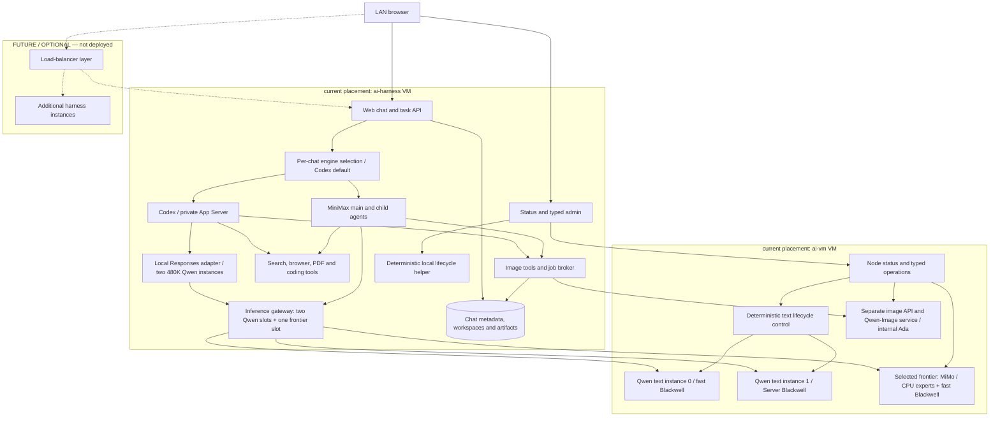

# Sova

Sova is the whole-system name for this open-source AI workspace project: a
chat/task harness, Codex and MiniMax agent runtimes, two Qwen text instances, a selectable
frontier reasoning worker, dedicated
image generation and guarded editing, search/browser/PDF/coding tools, and
deterministic lifecycle, status and administration software. Source paths, VM
names and runtime identifiers retain their existing names. First-party harness
additions are MIT; upstream tools, dependencies and models retain their own
licenses. The intended top-level Apache-2.0 text remains outstanding; see
[License](#license) and [component licenses](ai-harness/README.md#licenses).

Start with the [harness user guide](ai-harness/README.md),
[architecture and future routing design](docs/sova-architecture.md), and
**[TODO and current H007 update policy](TODO.md)**. The
[H006 registry/configuration extension guide](ai-harness/docs/status-registry.md)
and [H006 closeout](docs/h006-closeout-20260926.md) describe the reviewed
observation and placement foundation. H006's naming and update-policy statements
remain evidence of that dated checkpoint; Sova is now the selected system name.
The manual-update policy now supersedes H006's package-installation-enabled
policy. Automatic APT updates and the discovered refresh/update timers are
disabled on both current VMs; Snap has a global indefinite hold. Current Sova
service launch paths remain pinned. Manual update commands are available.
See the [verified policy and coverage limits](docs/h007-update-policy-20260926.md). The historical H006
report stays unchanged. Maintenance-window automation is future work.

**September 30 H037 deployment:** Codex 0.158.0 is the new-chat default;
MiniMax remains selectable and existing conversations retain their engine.
The image service is moving to the internal Gen4 x16 Ada, replacing its separate
200K Qwen instance. Backend delivery and fresh image/frontier qualification are
in progress. Optional tools stay closed until their actual placement and workflow
pass. See the [H037 plan](reports/h037-execution-plan.md).

The [earlier recovery report](reports/h036-resumed-recovery.md) and
[compact results](reports/h036-resumed-recovery-results.json) preserve the
07:45 UTC checkpoint, when MiniMax was the default, three Qwens were ready and
the external image GPU was intentionally absent. These are historical results.
The external Core X Ada remains intentionally excluded from passthrough.

Retained evidence covers image generation/guarded editing, coding and follow-up,
PDF extraction/OCR, and Qwen compaction of 402,104 input tokens into a 237-token
summary preserving four facts. The interrupted conversation was physically
recovered without changing its original outcome, messages or files. A distinct
follow-up passed, reading the retained file and returning all four facts and the
correct calculation. This does not isolate summary-only recall because the file
also contains those facts. Normal Chrome ZIP completion, integrity and saved-link
reload pass. The controller observation repair is deployed; a fresh Codex MiMo
child executed a real Python tool, continued from its result and returned the
correct final answer. Parent and child fully settled. MiniMax native image
recognition is **PARTIAL**; Codex native vision is **UNSUPPORTED**. Document/OCR
and specialist image generation are separate capabilities.

The [harness guide](ai-harness/README.md#capacity-and-context) explains context and
compaction. The [H036 plan](reports/h036-execution-plan.md) defines the authorized
work; [H035](reports/h035-codex-checkpoint.md) remains the unchanged earlier
checkpoint. Status and hardware history remain in
[H020](docs/h020-results.md), [H025](reports/h025-overview.md) and
[H028](reports/h028-overview.md). The retired Ada 200K API is not in harness routing.

```mermaid
flowchart TB
    User["LAN browser"]
    subgraph H["current placement: ai-harness VM"]
        Web["Web chat and task API"]
        Engines["Per-chat engine selection / Codex default"]
        Agent["MiniMax main and child agents"]
        Codex["Codex / private App Server"]
        Responses["Local Responses adapter / two 480K Qwen instances"]
        Tools["Search, browser, PDF and coding tools"]
        Gateway["Inference gateway: two Qwen slots + one frontier slot"]
        ImageJobs["Image tools and job broker"]
        Data[("Chat metadata, workspaces and artifacts")]
        Status["Status and typed admin"]
        Helper["Deterministic local lifecycle helper"]
    end
    subgraph M["current placement: ai-vm VM"]
        Node["Node status and typed operations"]
        Control["Deterministic text lifecycle control"]
        Q0["Qwen text instance 0 / fast Blackwell"]
        Q1["Qwen text instance 1 / Server Blackwell"]
        Frontier["Selected frontier: MiMo / CPU experts + fast Blackwell"]
        Image["Separate image API and Qwen-Image service / internal Ada"]
    end
    subgraph Future["FUTURE / OPTIONAL — not deployed"]
        LB["Load-balancer layer"]
        Replicas["Additional harness instances"]
    end
    User --> Web
    User --> Status
    Web --> Engines
    Engines --> Agent
    Engines --> Codex
    Codex --> Responses
    Responses --> Gateway
    Codex --> Tools
    Codex --> ImageJobs
    Web --> Data
    Agent --> Tools
    Agent --> Gateway
    Agent --> ImageJobs
    ImageJobs --> Data
    Gateway --> Q0
    Gateway --> Q1
    Gateway --> Frontier
    ImageJobs --> Image
    Status --> Node
    Status --> Helper
    Node --> Control
    Node --> Image
    Node --> Frontier
    Control --> Q0
    Control --> Q1
    User -.-> LB
    LB -.-> Web
    LB -.-> Replicas
```

Boxes describe logical roles; some share a process. Cross-VM calls use the
reviewed private transports. The optional future load balancer and its dashed
links are **not deployed** and are not required for every topology. Harness
replication requires the ownership, shared data and admission work described in
the [architecture](docs/sova-architecture.md#placement-and-horizontal-scaling).

Two VMs are the current placement, not a mandatory architecture. One host/VM can
colocate compatible services; future deployments may span many VMs with multiple
instances per model. Every placement still needs compatible hardware and runtime,
adequate resources, registered storage, network/security policy and explicit
deployment work. Registry edits alone do not relocate workloads or select models.

The ai-vm role remains API-only, with separate direct inference endpoints and
**no common ai-vm inference router**. The harness gateway provides two Qwen slots
and one independent frontier slot; image jobs use their own service. Qwen coordinates
tasks and normally handles coding and agentic work. Both engines can delegate difficult
research, document analysis and reasoning to a native frontier child running
the selected qualified frontier model. This fixed routing policy does not implement
arbitrary-model selection. See [H009 delegation qualification](docs/h009-status-20260926.md) and
[H010 64K benchmark and capacity estimate](docs/h010-status-20260927.md).

## Current models and dated acceptance

MiMo V2.6 Pro-RL is active at **480,000 configured context tokens**, with its
protected profile delivered to both harness launch paths. Fresh native tool
calling and actual-result continuation passed after recovery, with full HTTP
completion and physical idle confirmed. These tiny requests establish workflow
and allocation, **not occupied-480K performance**. Fresh MiniMax and Codex
delegation both passed with actual tool calls and complete settlement. Historical full-roster/schema and
65,536-output-ceiling support is carried forward only for the unchanged runtime;
earlier 950K workflow results are not relabeled as 480K tests.

Qwen0 and Qwen1 retain 480,000-token configurations and the two shared harness
lanes. The separate 200K Qwen Ada API is being retired, retaining its weights and history;
it is not a 480K fallback. GLM-5.3-Flash's retained 1,048,576-token profile is dormant. MiMo and
GLM are alternate owners of frontier hardware, not simultaneously resident.
Qwen-Image-2.1 uses a separate Ada service for generation and guarded editing.
H037 changes its selection to the internal Ada; optional tools remain closed
until fresh qualification. See [image sizes and limits](ai-harness/README.md#image-generation-and-editing).

No 1M, 950K or full occupied-480K benchmark was repeated for H036. Preserve the
[failed near-950K result](reports/h022-950k-status.md),
[earlier MiMo measurements](docs/h016-mimo-results-20260927.md),
[GLM 1M evidence](docs/h013-status-20260927.md),
[Qwen migration measurements](docs/h008-status-20260926.md) and
[historical dual-Q acceptance](reports/dualq-480k-20260921.md).
Those dated measurements do not establish current readiness or aggregate
throughput. Sustained four-model load remains unqualified after the retained
thermal-guard failure. [Full HD image acceptance](reports/image21-fhd-20260923/RESULT.md)
and [guarded editing limits](reports/h003-edit-capacity-20260923/RESULT.md)
retain their original scope.

## Use the APIs

Control uses `http://10.156.100.60:30000/control/v1/...`. Clients discover and
explicitly address separate inference bases: Qwen0 on 30002, Qwen1 on 30004,
MiMo on 30012 and dormant GLM on 30010, each with
`/v1`. Discover current identity and readiness before use. These direct ai-vm
APIs have no common inference router or automatic fallback; the harness's
Qwen/frontier gateway is a separate client-side component. Native listeners stay
authenticated IPv4 loopback behind the reviewed private transport.

- [Image API source and integration](docs/image-api.md): private image API interface.
  The [current acceptance report](docs/service-resilience-acceptance.md) records
  qualified generation/editing, retained limitations and exact runtime identities.
- [API operations and examples](docs/ai-vm-api-operations.md): discovery,
  separate credentials, targeted switch/poll and inference.
- [Control contract](docs/control-api.md) and [inference contract](docs/api-contract.md).
- [Operations](docs/operations.md): durable VM ownership, guards and recovery.
- [Mode, migration and rollback contract](docs/concurrent-api.md).
- [Private client transport](docs/direct-client-network.md) and
  [protected credentials](docs/agent-client.md#protected-key-file).

`mutation_busy` describes lifecycle work; readiness does not mean idle. The
harness owns its dispatch, backlog and drain before a targeted switch. Switching a
running target requires `allow_interrupt:true`, fresh identity/generation and
operation polling; the server provides no atomic drain guarantee.

The [September 26 resilience closeout](docs/h005-closeout-20260926.md) records
successful idle/wake and sequential VM reboot recovery. Both Qwens and the Ada
image service restored automatically. Status/admin services, history metadata
and current-boot task containment were verified. Earlier failed attempts remain
in the linked historical record.

Tools, browsing and file work run as an ordinary user in trusted client
workspaces, currently through [ai-harness](ai-harness/README.md) on its own VM.
It provides the deployed shared-LAN chat and task interface; that placement is
not a requirement for all Sova deployments. General installer expansion remains
deferred; H036 included narrow existing CI fixture/temporary-path repairs.

## Status and administration

Open [status](http://10.156.100.61/status) for read-only service observations and
[admin](http://10.156.100.61/admin) for canonical typed operations. Admin uses the
deployed anonymous trusted/shared-LAN access scope: it has no per-user login or
authentication. Normal operations use admin so ownership, holds and receipts are
maintained; follow the [operator guidance](ai-harness/README.md#operator-use) for
status meanings, idle/wake behavior and uncertain results.

The optional `status.ai-harness` DNS alias is user-managed and status-only. A local
DNS entry may point it at `10.156.100.61`; this guide does not claim DNS is configured.
Use the recorded IP-based admin address above for operations.

## Historical evidence

The prior [singleton acceptance](reports/apiaccept-lan-acceptance.md),
[stage-one qualifications](reports/stage1-ai-vm-status.md),
[cleanup report](reports/finalops-reboot-cleanup.md) and
[installer record](docs/installation.md) retain their original scope. Earlier
TP2/1M configurations and success statements do not establish current dual-Q
acceptance. Historical reports are unchanged.

## License

First-party harness server, tool and skill additions are MIT; see the
[component licenses and notices](ai-harness/README.md#licenses). Upstream tools,
dependencies and model weights keep their own terms, including the separate
AGPL-3.0-or-later SearXNG service. This is not a blanket MIT relicensing.
The intended top-level Apache-2.0 text is still outstanding:
[LICENSE.todo.md](LICENSE.todo.md).
