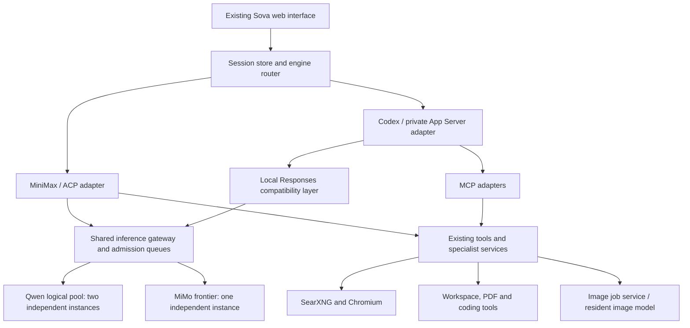

# Codex as an optional Sova harness

**Status: implementation authorized — September 28, 2026.** H020 published
this plan; H021 implements it after the user's explicit follow-up. See
`docs/h021-codex-execution.md` for current scope and evidence.

## Decision

Add Codex alongside MiniMax behind Sova's existing engine interface. Keep
MiniMax available and retain the current UI, conversations, workspaces,
inference queues and specialist services. Initially select the engine when
creating a chat; retain that choice for follow-ups. Do not change the default
until a bounded comparison demonstrates that the alternative works better.

Use the **Codex App Server from the open-source CLI** for the interactive
integration, with a private stdio connection. This is a controlled pilot:
OpenAI currently labels the app-server command and WebSocket transport
experimental and unsupported for production workloads. Stdio avoids exposing
another network listener but does not remove that qualification. The SDK or
`codex exec` can serve later batch use; they are not the proposed chat transport.
[Official App Server documentation](https://learn.chatgpt.com/docs/app-server).

The CLI, SDK and App Server are open source; this does not embed the ChatGPT
desktop application or its hosted services. Preserve upstream licenses and
notices; keep Sova's own additions MIT. Pin the reviewed Linux binary, its source
revision and protocol schema during implementation. The locally observed
`0.158.0-alpha.2.1` binary is research evidence, **not a release selection**.
[Open-source components](https://learn.chatgpt.com/docs/open-source).

## Architecture

The Responses layer is conditional: reuse a backend's native implementation
only if it passes the required contract. Otherwise put a narrow adapter in the
Sova gateway. Both paths retain the same global slot ownership. No model-runtime
replacement is part of this plan.

**Engine and model are separate choices.** Codex and MiniMax can both use Qwen
and delegate selected work to MiMo. An image model is a specialist tool, not a
general-purpose agent or coordinator. Deployment configuration describes which
host runs each service; an engine must not assume that every service shares its
VM. One VM can initially run both engine types in separate task containers.

## 1. Resolve the main compatibility risk first

The deployed inference path uses Chat Completions. Current Codex custom-provider
configuration supports the Responses wire API. Therefore changing only a base
URL is not sufficient evidence of compatibility. A hosted MiMo example also
does not qualify our local runtime.
[Provider configuration reference](https://learn.chatgpt.com/docs/config-file/config-reference).

Before UI development, run a small protocol qualification task against the exact
pinned CLI and local runtime. Establish:

- Streaming message and tool-call event ordering, unique call IDs, multiple tool
  calls, tool results and a successful second turn.
- Translation of the actual tools emitted by that CLI, including shell/edit
  tools and any custom/free-form tool schemas. Reject unsupported tool types
  explicitly; never pretend a function-schema conversion is lossless.
- Reasoning and final output handled separately where the provider supplies
  reliable metadata. No fabricated encrypted reasoning items or guessed
  internal thoughts. Preserve required local-model reasoning fields across
  tool continuations only under a verified contract.
- Input reconstruction, instruction precedence, multimodal attachments where
  supported, usage counters and context errors. Declare unsupported media
  rather than silently dropping it.
- Explicit state ownership: either client-carried history or implemented
  response-ID storage with defined retention. Never accept a continuation ID
  without being able to reconstruct its history.
- Partial streams, dropped clients, native failure and cancellation. A second
  HTTP request must not duplicate an inference whose completion is uncertain.

Use captured protocol fixtures and short native cases. Do not repeat GPU
capacity benchmarks or the ongoing near-950K test. If this gate fails, report
the exact unsupported behavior and repair estimate before expanding scope.

## 2. Engine adapter and durable sessions

Implement a `CodexEngine` beside the existing ACP implementation, using
`server/src/contracts.ts` (`Engine`, `EngineOptions`, `EngineUpdate`). Keep the
public application independent of native engine protocols.

Proposed stored fields: engine kind/version, native thread ID, active turn ID,
event cursor, model-policy version and workspace ownership. Migrate existing
rows to explicit `minimax`; preserve original history and generated files.
Do not try to resume a MiniMax native session inside Codex. An intentional
engine change creates a new chat with a handoff summary and the same permitted
project files, with shared-workspace serialization retained.

Map native lifecycle and progress into existing Sova events. App Server exposes
thread resume, turns, steering, interruption, compaction and token-usage updates;
agent messages may carry a commentary/final-answer phase. Use versioned schema
fixtures and handle absent optional metadata explicitly.
[App Server API](https://learn.chatgpt.com/docs/app-server).

Required behavior:

- Browser reconnect replays persisted UI events without repeating prompts.
- Service restart identifies interrupted work; it never blindly resumes an
  uncertain task. Native work and inference must settle before releasing locks.
- Stop handles parent, children, queued calls, terminals and accepted GPU work.
  A client-side cancellation acknowledgement is not proof that the GPU stopped.
- Context display measures occupied context, not cumulative billing tokens.
  Original messages stay visible after native compression.
- Real commentary/tool progress appears under Activity; final answers remain
  separate. Missing phase information is shown as unclassified output rather
  than rewritten into a fabricated reasoning trace.
- Where the pinned adapter qualifies mid-turn steering, expose it deliberately;
  otherwise preserve Sova's current queued-follow-up behavior.

## 3. Local models, delegation and context

Proposed initial policy remains:

| Role | Backend | Admission | Context target |
|---|---|---:|---:|
| Coordinator, routine agents and coding | Qwen logical pool | Two shared inference slots | 480,000 |
| Difficult independent research/analysis | MiMo V2.6 Pro-RL | One frontier slot | 950,000 |
| Creative image work | Existing image-job service | One active image job | Operation-specific image limits |

These are deployed/configured targets, not Codex qualification results. Full
MiMo window occupancy remains subject to the independent H019 benchmark; its
ordinary Sova workflow also has a separate unresolved integration issue.

Codex supports custom subagents with their own model settings. Configure an
explicit Sova delegation policy and test that actual child requests reach the
intended logical model. Native support alone does not demonstrate local-model
tool reliability or correct queue behavior.
[Subagents](https://learn.chatgpt.com/docs/agent-configuration/subagents).

Keep a GPU slot only while an inference owns it. Parents waiting for children
must not retain a slot. Apply global admission to main, child, compaction and
auxiliary requests, with bounded child counts and task budgets. Default to Qwen
for coding and everyday agent work; MiMo is deliberate escalation, not an
automatic retry for every failure. Both engines share these queues.

Generate provider/model metadata from reviewed Sova configuration. Explicitly
set the model context and compaction threshold; do not inherit an OpenAI-model
default. Retain the **65,536-token output ceiling** and reserve template/tool
overhead within each model's total window. Verify the pinned version's model
catalog and output-budget mechanism; do not invent an unsupported configuration
key. Enforce actual input-plus-output capacity at the gateway/tokenizer boundary.

Qualify local compaction with a reduced test threshold and recall checks. Store
the uncompressed conversation separately and keep Continue in new chat. Avoid
endless retries when compaction, token admission or a model capability fails.

MiMo may have long prefill periods without output. Preserve its existing
eight-hour active-request allowance and separate queue deadline; distinguish
transport keepalives from token progress. Reconnect must attach to the existing
task rather than resubmit it. Bound provider retries so Codex and the gateway
cannot multiply retries across layers.

## 4. Tools, containers and local operation

Reuse existing capabilities through reviewed MCP adapters:

- SearXNG search and local Chromium navigation/rendering/downloads. MiniMax's
  native browser integration does not automatically transfer to Codex; provide
  a browser adapter explicitly. Keep public-web scope and source links.
- PDF extraction, page rendering, OCR and basic creation; existing workspace
  artifact/download/ZIP behavior.
- Existing image capabilities, generation and guarded edits, including resize
  approval, source/seed rules, queue ownership and cancellation semantics.
- C/C++, Python and Node.js tools in the current rootless task environment.
  Review existing skills for engine-specific assumptions before reusing them.

Use a task-scoped Codex home inside each isolated workspace/container. Mount
provider policy and tool configuration as trusted, read-only configuration.
Give tasks scoped gateway credentials; retain real inference keys, host SSH
keys, BMC secrets and administration sockets outside task containers.

Do not expose App Server RPC directly to browsers. Sova remains responsible for
allowed operations and approvals. Exclude out-of-sandbox administrative process
RPCs from the web adapter. A native sandbox is not a replacement for Sova's
rootless container boundary or future organizations/users/permissions.

Local inference uses a custom provider without OpenAI login or paid-API
fallback. Disable hosted web-search routes for this provider and use local MCP
search. Test behavior with internet disconnected: local coding/models remain
usable; external web research reports its unavailability. Disable automatic
dependency, plugin and engine updates; retain the planned maintenance-window
and rollback policy.

## 5. UI and status changes

Add a small **Harness: MiniMax / Codex (preview)** choice for new chats only,
enabled by deployment policy. Existing chats keep their engine. Display the
engine on the chat and show unsupported capabilities clearly. No accounts,
general settings redesign or broad model-selection UI is needed for this pilot.

Reuse conversation rendering, tool details, subagent counts, context usage,
attachments, inline image artifacts and downloads. Add engine service/version
and capability health to the status registry without tying model availability
to one harness. Keep model instance identity and GPU placement independent.

## 6. Bounded implementation sequence

| Stage | Worker1 | Worker2 | Exit condition |
|---|---|---|---|
| A: protocol gate | Pin Linux CLI; verify Responses/local-model contract | Independently review schemas, licenses and fixture cases | Both Qwen and MiMo complete a short tool/continuation case, or a precise blocker is reported |
| B: application adapter | Provider compatibility and queue/cancel ownership | Engine adapter, persistence and event/UI mapping | Focused lifecycle and reconnect fixtures pass |
| C: tools and delegation | MCP browser/search/PDF/image integration | Subagent routing, context/compaction and UI acceptance | Short real tool workflows pass on intended services |
| D: comparison and pilot | Deploy isolated preview and collect measurements | Independent acceptance and rollback verification | Reviewed report; default-engine decision remains explicit |

Use fresh bounded worker sessions and isolated copies, central deployment
coordination, compact evidence and checkpoints. Do not keep paid sessions open
while native inference runs. Limit each stage before starting; protocol discovery
must not become an open-ended engine rewrite.

Compare both engines on the **same models, fixtures, context/output budgets and
tools**: one Python bug fix/test, one C/C++ task, one Node task, one technical web
research task, one PDF/datasheet task and one image-tool task. Record completion
correctness, elapsed time, input/output tokens, retries, tool failures and manual
interventions. Harness features do not establish a model-quality improvement.

## Acceptance and rollout gate

- Both engines remain selectable; old MiniMax chats and files are intact.
- Qwen main/child work uses both available instances without queue deadlock;
  MiMo escalation uses its own lane; image work uses its existing service.
- Tool IDs, final/progress separation, attachments, links and downloads survive
  multi-turn use, refresh and compression.
- Stop, restart, duplicate submission, stale backend and failed compression
  have explicit terminal outcomes and no unowned GPU work.
- Configured contexts/output limits reach the actual provider without hidden
  clamps; estimates are checked against the deployed tokenizer.
- No OpenAI chargeable inference/search, hidden provider fallback, leaked
  credentials or host administration access occurs in local mode.
- Offline behavior and unsupported capabilities are documented.
- A status-only or engine-specific rollback preserves user data and model
  services. MiniMax remains the default until the pilot is reviewed.

### Current implementation status

H021 delivered a selectable controlled preview. The
[acceptance report](../reports/h021-codex-preview.md) records tested coding,
research, delegation and lifecycle behavior, retained PDF/image failures and
remaining qualification. MiniMax remains default; Codex image tools are disabled.
Full parity, live compaction recall and second-lane qualification remain pending. The existing MiniMax-to-MiMo HTTP400 repair
and completion review of the running near-950K benchmark remain separate work;
this plan does not claim either is fixed. MiMo live Codex qualification is
deferred while that benchmark owns the frontier runtime.
