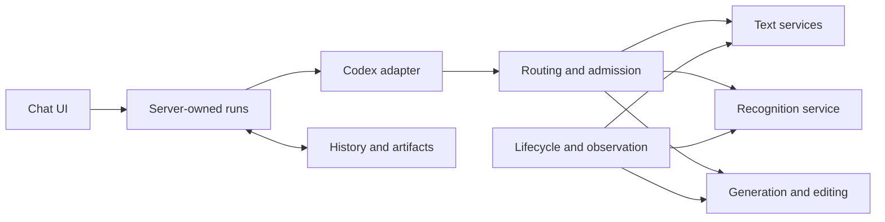

# V2 design input for review

This is a concrete starting design, subject to human review before rebuild execution. It carries forward the [user vision](VISION.md) and [four foundation tasks](../TODO.md), with V1's failures used as regression cases. It does not implement these files or protocols.

## Small independently testable units

| Unit | Owns | Independent acceptance |
| --- | --- | --- |
| Chat UI | Presentation, user input, reconnect cursor | Render/reconnect against a contract fixture; closing the browser cannot cancel a run. |
| Application/run owner | Chats, durable run/job state, deadlines, cancellation coordination and artifact references | Direct API client runs and reconnects without a browser; restart reconciles unfinished work without replay. |
| Codex adapter | Native thread/turn/tool/compaction mapping | Direct transcript/protocol fixtures plus a real short tool workflow; final event and task fulfillment are distinct. |
| Routing/admission | Capability selection, compatible-instance reservation and bounded queues | Direct queue/concurrency/cancellation tests; waiting parents release inference capacity. |
| Text model service | Text inference and actual request settlement | Standalone authenticated smoke client and measured capacity/context test. |
| Recognition service | Source/crop observations and technical descriptions | Direct annotated-image client; exact labels/units, evidence regions and uncertainty. |
| Generation/editing service | Image requests and decoded outputs | Direct client from warmup to saved artifact, followed by normal chat integration. Recognition may be unavailable. |
| History/artifact store | Original records, versions, integrity and scoped retrieval | Direct persistence, restart, publication and access tests. |
| Lifecycle/resource control | Scoped starts/stops, current owners, resources and observation | Independent health refresh plus finite owned mutations; waiting workflows hold no shared lock. |

These are logical responsibilities. They need not each be a separate process. Every new process, protocol, config file and dependency must solve a stated requirement. Start with the smallest arrangement that can execute and test each responsibility directly.

The server owns run lifetime. The browser observes events and sends explicit commands. Text, recognition and generation have independent readiness and restoration; only a documented actual shared-resource conflict may block another capability. All required models must be able to remain resident and perform overlapping real work. Serial tests, visible idle cards or individual successful starts are insufficient.

## Configuration: exact candidate files and ownership

Use **one editable deployment-intent file, `sova.yaml`**, validated by a versioned **`sova-config.schema.json`**. This is the proposed naming and file boundary for review. Services derive their own configuration; derived files are not a second editable source. A documented validator rejects unsupported combinations before activation and leaves the last validated configuration active.

| Section of `sova.yaml` | Required meaning / reader |
| --- | --- |
| `schemaVersion` | Schema/migration contract; all loaders reject unknown versions. |
| `nodes` | Stable node IDs and placement/resource/transport references; lifecycle and deployment readers. |
| `modelDefinitions` | Model/artifact identity, role, capabilities, runtime compatibility and supported limits; routing/model loaders. |
| `modelInstances` | Definition/node references, stable GPU UUIDs, endpoint references and capacity policy; admission/lifecycle readers. Model family, instance and host are distinct. |
| `routing` | Automatic capability rules, default general model and permitted deep-reasoning model; routing reader. No chat model selector. |
| `limits` | Context/output/compaction policy, bounded queues, deadlines, stream/output limits; owning adapter/admission/run readers. State each unit. |
| `storage` | History/artifact locations, retention and publication policy; storage reader. |
| `services` | Logical placement and enabled capabilities; deployment reader. |
| `secretRefs` | Logical protected references only; authorized service-side resolver. No secret values or private transport details in public output. |

Define defaults and precedence explicitly: schema defaults, then the validated file; any operator override must be listed, validated and included in the effective-config digest. Avoid undocumented environment overrides. For every field document reload versus restart, compatible version changes and migration/rollback effects. Include valid single-host and split-host examples without secrets.

Durable job/owner/incident state belongs to the owning store, **outside deployment intent**. Health observations are cached runtime records with timestamps and freshness. Neither is an editable configuration file. Old receipts and boot IDs cannot be copied into new current state. Exact deployed config/model/runtime revisions accompany evidence; they do not dictate all future versions.

## Protocols to define before integration

Choose and version the transport for each boundary, then publish its executable schema and direct client. The initial contract set must define:

- **Identity:** organization scope when introduced; chat, run, task, artifact, model definition, model instance, node, and owner-generation IDs. A host boot ID belongs to that host; independent hosts must not share one.
- **Start:** authenticated principal/capability, validated input/artifact references, idempotency key, deadline, requested output and assigned durable run ID. A retry returns the existing run rather than dispatching another side effect.
- **Events:** `runId`, monotonically ordered sequence/cursor, timestamp, typed progress/tool/artifact/terminal payload, and bounded sizes. Reconnect requests events after a cursor; progress text is not a final result.
- **State:** `queued`, `running`, `completed`, `failed`, `cancelled`, `uncertain`, with documented allowed transitions and durable recovery. Add paused state only when its semantics are implemented and tested.
- **Completion:** separate native turn termination, user-visible task result and resource settlement. A final planning sentence is an incomplete result, not a passed workflow. Define bounded continuation or an explicit incomplete outcome; avoid unconditional reruns.
- **Cancellation:** idempotent request and acknowledgement, then independently confirmed settlement of actual computation/children/tools. Accepted cancellation or a closed stream does not mean GPU work has stopped. Unsupported cancellation is explicit.
- **Errors/retries:** stable codes for unavailable capability, capacity/deadline, invalid input/config, authentication/authorization, interrupted owner and uncertain side effect. Retry only according to the contract; reconcile unknown effects.
- **Readiness and admission:** compatible protocol/config/runtime plus current service owner and health. Readiness is not free capacity; reserve actual capacity atomically across every parent, child and auxiliary request.
- **Control:** observation is read-only and independent of mutations. Start/stop/recover commands have a finite operation, resource scope and current owner. A workflow waiting for its next step releases mutation locks.

Integrity and permissions remain real requirements. Move compatibility checks to configuration/deployment boundaries where appropriate; request-time checks should use the smallest current health/ownership/capacity contract that protects the operation. Historical qualification packets are evidence, not a live dependency graph or future authority.

## Test catalogue and execution system

Each catalogue entry records requirement, level, exact fixture/workload, config/model/runtime versions, preconditions, expected output/state/settlement, bounds and cleanup. Retain original logs and explicit PASS/FAIL/PARTIAL/NOT_TESTED outcomes. A later observation can establish recovery without rewriting the original failure.

| Test group | Required cases |
| --- | --- |
| Deterministic unit/contract | Configuration examples/invalid precedence, identity domains, event cursor ordering, state transitions, idempotency, limits, token reservation, receipt publication races and stale observations. |
| Direct component | Each unit starts and is called alone. Vision maintenance cannot block text proof renewal; generation restores with vision offline; status changes do not force unrelated model reloads. |
| Real model services | Text/tool continuation; annotated technical recognition; decoded generation/edit output; current owner and supported cancellation; measured memory/context and external-link behavior. |
| Full-suite concurrency | Overlapping text, difficult reasoning, recognition/parser and generation on all required resident instances; verify outputs, headroom, queue fairness and settlement, with no forced specialist unloading. |
| Normal single-PC workflow | Complete answer/research, automatic selection, files/public retrieval, upload/recognition, generation/editing, follow-up, cancel/failure, closed-tab reconnect, PC sleep, application restart and interrupted-owner recovery. |
| Compaction | Manual, genuine automatic near-threshold and repeated cycles; exact technical answer key, superseded decisions, summary-only recall, source retrieval, continuation, timeout/cancel/death and cold resume. |

Proposed execution entry points are `test fast` for deterministic suites, `test component` for direct units, `test live --profile <validated-profile>` for explicitly bounded real services, and `test workflow --profile <validated-profile>` for ordinary flows. The implementation may select its runner, but must document exact commands and make fast suites usable in CI. Live tests are deliberately selected with finite time/resource bounds; fixtures never count as GPU or complete workflow acceptance.

A reused component passes its direct gate before integration. The first release then passes the full normal flows and concurrency gate. Keep the test/evidence index small and current. The release readiness report must show missing cases as missing; quantity of source checks is not a completion criterion.
