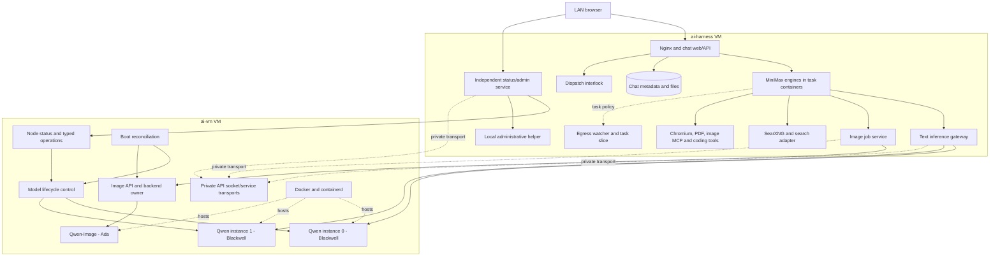

# H006: image reliability and system service topology

Date: 2026-09-26. Baseline: `d703a254033cacc227644be47cc2d1150ac908f4`.
The user authorized planning followed by worker implementation. The overall
system name remains undecided; `ai-harness` continues to identify its current VM.

## Outcomes

1. Explain and repair the image service's reported unavailability after hours
   idle. Preserve evidence before recovery; distinguish native/API failure from
   stale status, hardware uncertainty and request-ownership protection.
2. A versioned central configuration describes nodes and service placement.
3. Status displays every configured node, its resources and every registered
   service with its current location, including unavailable/unknown nodes.
4. Keep healthy peers usable when another service or node fails.

## Current logical layout

Some boxes are components of one deployed service, not separate restartable
processes. The registry must express this distinction. Node monitoring and
supporting host services must not disappear merely because they have no GPU.

The implemented inventory is in
[`ai-harness/config/system-registry.json`](../ai-harness/config/system-registry.json):
seven managed services plus 25 supporting or in-process components. The private
transport box groups the fixed control/node/image and two text socket/service
pairs; the task boxes group the on-demand MiniMax engine and its tool adapters.
SearXNG includes its rootless container/transport. SQLite and workspace files are
storage, not separate database daemons. A listed component without an independent
probe has unknown health; its parent's availability is not a health certificate.

`control` is deterministic lifecycle software, not a model. MiniMax agents use
models for reasoning and delegation. A future capability-aware model router can
combine an LLM's task classification with ordinary code enforcing capabilities,
availability, context limits, queues and permitted operations. Model output alone
must not grant host administration authority.

## Registry and status contract

- Stable logical service IDs and instance IDs are separate from node IDs, URLs,
  ports and GPU identity. Configuration records placement and dependencies.
- Nodes have a display name and an explicit observation transport. Services
  describe their role/capabilities, owning node, endpoint references, dependency
  or parent component and whether lifecycle actions are actually supported.
- Credentials remain protected server-side references, never registry API data,
  browser configuration or task-container mounts.
- Status combines configured identity/placement with observed state. It does not
  fabricate readiness from configuration, or treat missing data as zero usage.
- Every configured node remains visible when unreachable. Collection is bounded
  and independent; one node cannot stall the others. Show observation freshness.
- Show node CPU, memory, disk and network information and service location.
  List dependent components without presenting unsupported restart buttons.
- Reuse existing typed lifecycle ownership, idempotency, hardware latches and
  scoped dispatch holds. Configuration alone cannot authorize arbitrary shell
  commands, remote actions or unsupported owner adapters.
- Preserve compatibility for current inference clients and existing service IDs.
  Reject ambiguous duplicate identities and inconsistent placement explicitly.

Placement must be portable to compatible registered VMs. This iteration adds the
configuration/observation foundation and removes unnecessary placement assumptions
in the affected paths. It does not move model weights or live conversations,
provision new VMs or claim an arbitrary-service migration orchestrator is tested.
Executable relocation needs corresponding runtime, storage, credentials, network
policy and hardware on the target, with an explicit deployment procedure.

## Work allocation and limits

- Mac-Orchestrator: plan, shared interface decisions, evidence/source review and
  GitHub publication.
- Worker1: image incident diagnosis and narrow correction/recovery; VM-side
  status corrections if demonstrated by evidence.
- Worker2: central registry, all-node/all-service status and location display,
  focused contract/UI tests and independent final checks.
- Use fresh bounded native Codex CLI tasks in isolated worker copies; retain
  session IDs, receipts and failure evidence. Initial diagnosis/discovery is
  limited to 15 minutes per worker. Implementation tasks use focused scopes and
  checkpoints rather than open-ended tuning or repeated benchmark campaigns.
- Shared deployment is serialized by root. Preserve chats, artifacts, canonical
  operation journals, model/runtime pins, GPU placement, 480K text contexts and
  existing Full HD/guarded-edit capabilities.

## Acceptance

- Root cause and corrective evidence distinguish actual image failure from a
  status-only problem. Recovery preserves healthy peers; no uncertain work is
  replayed. Use one meaningful image request only if needed to verify a repair.
- Both real VMs and all configured services appear with correct placement.
- Fixtures cover an additional node, unavailable node/service, partial metrics,
  malformed registry and duplicate IDs; healthy peers remain visible/usable.
- Read-only status has no administration side effects; unsupported components
  expose no lifecycle actions. Current admin actions retain their protections.
- Review actual browser/API output and focused worker tests. Label fixture,
  live and untested evidence separately. Publish source, plan and results.

Accounts, reduced end-user disclosure, renaming, new models, automatic model
selection, installer development and live relocation remain later work. Internal
technical detail must remain separable from the future end-user status view.
